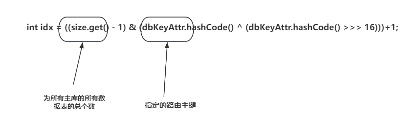
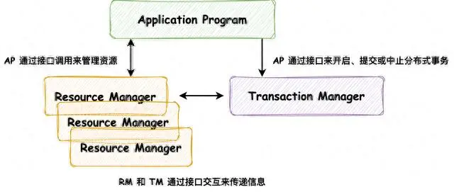

## 实现功能

**分库分表路由**

**读写分类隔离**

**多数据源事务**

## 数据库设计

## 分库分表路由

自定义注解AOP来指定待操作数据表的路由主键(一般为数据表的主键)，通过hash扰动函数散列出主键对应的数据主库和数据表。如下图：

数据库决定使用那个datasource，数据表通过mybatis拦截器拦截sql语句修改待操作数据表。

## 读写分类隔离

通过Mybatis拦截器插件对当前数据库操作进行读写判断：

如果是读操作，不进行事务，由上一步路由得到的数据主库找到对于对的从库，从从库中随机选取一个数据库，其对于的数据操作表编号不变。

如果是写操作，可以进行事务，由上一步路由得到的数据主库和数据表编号，直接操作。

## 多数据源事务

在单体应用下，在对应方法上加上自定义事务注解，就可以实现在Spring没有不支持的多数据源事务控制。

配置XA数据源，使用Atomikos-JTA实现。

**XA （eXtended Architecture 扩展架构）** 是 **X/Open组织** 提出的 **跨异构技术实现两阶段提交** 的接口标准。

> 分布式事务包含两种类型：**数据库内部的分布式事务**，在这种情况下，所有参与事务的节点都运行相同的数据库软件；**异构分布式事务**，参与者由两种或两种以上的不同数据库软件组成。

它不是一个网络协议而是定义了 **事务管理器（Transaction Manager）、应用程序（Application Program）** 和 **资源管理器（Resource Manager）** 之间交互的 **CAPI(Common Application Programming Interface)** 接口标准，如下图所示

其中三个组件的职责如下：

应用程序（Application Program）：负责定义事务的开启、提交或中止，并能够访问事务内的资源（数据库等）

资源管理器（Resource Manager）：负责对资源进行管理，相当于两阶段提交中的参与者，能够与事务管理器通过接口交互来传递必要的事务信息

事务管理器（Transaction Manager）：负责管理全局事务，分配事务ID，监控事务的执行进度，并负责事务的开启、提交和回滚等，相当于两阶段提交中的协调者

许多传统关系数据库包括 PostgreSQL、MySQL、DB2、SQL Server 和 Oracle；消息代理包括 ActiveMQ、HornetQ、MSMQ 和 IBM MQ都支持 XA。

符合XA 模式的由TM, RM控制的两阶段提交，RM由关系型数据库厂商提供实现(例如mysql，oracle数据库，本身支持分布式事务)，java对XA规范的实现叫做JTA，JTA中TM具体实现包括Atomikos，Narayana，JOTM，BTM等。

XA分为 **准备阶段** 和 **提交阶段**，两个阶段，它对分布式事务管理的流程如下

- **准备阶段**：AP与TM交互，开启一个 **全局分布式事务**，并发送请求到每个RM，执行数据变更逻辑，此时每个RM会向TM发送请求注册 **分支事务**，在执行完业务逻辑后报告准备提交的状态（事务执行完未提交），之后AP会根据RM的响应在 **提交阶段** 做出反馈
- **提交阶段**：如果所有的RM都回复“是”，表示它们已经准备好提交，那么AP会在该阶段向TM发出提交请求，分布式事务提交；否则，AP会向TM发出中止请求，分布式事务回滚

>但是这种XA模式是有局限性的，只能够解决单个应用(单业务系统架构)中跨越多个数据源时（分布式数据库，数据库的水平拆分）数据操作的事务一致性问题，但是遇到分布式系统（例如Dubbo）中多个应用服务之间（ 分布式服务，业务服务化拆分）数据操作的事务一致性问题时，它就不起作用了，也就是说只适用于单业务系统架构，当然了，在分布式系统中，如果没有遇到跨微服务访问数据库的事务问题时，跟这个其实也是类似的。还有其它局限性，例如必须要拿到所有数据源，而且数据源还要支持XA协议；性能比较差，要把所有涉及到的数据都锁定，是强一致性的，会产生长事务。

>Seata中XA模式有三个角色 **事务管理器（Transaction Manager）**、**资源管理器（Resource Manager）** 和 **事务协调者（Transaction Coordinator）**。与XA协议标准中角色的定义有所区别：事务管理器（Transaction Manager）应该对应XA协议中的应用程序（Application Program）；事务协调者（Transaction Coordinator）对应XA协议中的事务管理器（Transaction Manager）。我认为它们只是在命名上的区别。

参考资料：

https://blog.csdn.net/wdquan19851029/article/details/111990912

https://baijiahao.baidu.com/s?id=1779319594015081987&wfr=spider&for=pc